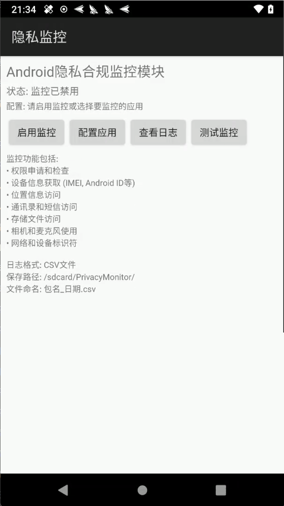

# Android隐私合规监控系统

[](LICENSE)
[](https://android-arsenal.com/api?level=21)
[](https://github.com/LSPosed/LSPosed)

一个基于Xposed框架的Android隐私合规监控系统，能够实时监控应用的隐私相关行为，帮助开发者进行隐私合规检查和代码修复。

## 📸 应用截图

<div align="center">
  
  
  
  
</div>

<p align="center">
  <em>从左到右：应用主界面 | 监控配置界面 | 日志查看界面 | 风险评估报告</em>
</p>

## 🎯 主要功能

### 全面的隐私行为监控
- **设备信息监控**: IMEI、设备ID、序列号、MAC地址、设备型号等
- **位置信息监控**: GPS定位、网络定位、位置权限检查
- **网络访问监控**: 网络状态检查、WiFi信息、运营商信息、HTTP/HTTPS连接
- **权限监控**: 敏感权限检查和申请
- **通讯录监控**: 联系人访问、短信、通话记录
- **媒体设备监控**: 相机、录音、麦克风访问
- **存储监控**: 文件访问、外部存储读写

### 智能SDK检测
- **阿里系SDK**: 包括阿里巴巴百川SDK、支付宝、淘宝推送等
- **腾讯系SDK**: 腾讯统计、微信支付、QQ互联等
- **百度系SDK**: 百度地图、百度定位、百度统计等
- **其他主流SDK**: 友盟、极光推送、华为HMS等200+个SDK

### 精准的调用栈分析
- **过滤框架噪音**: 自动过滤Xposed框架相关调用
- **突出应用代码**: 重点显示应用自身和SDK的调用链
- **SDK标注**: 自动识别并标注SDK调用
- **简化显示**: 提供易读的调用栈信息

### 详细的风险评估
- **风险等级分类**: 🚨高风险、⚠️中风险、ℹ️低风险
- **修复建议**: 针对每种隐私操作提供具体的修复建议
- **合规指导**: 基于隐私保护法规的合规建议

## 📱 系统要求

- Android 5.0+ (API Level 21+)
- 已安装Xposed框架（推荐LSPosed）
- Root权限

## 🚀 快速开始

### 1. 下载安装

#### 方式一：下载预编译APK
项目上直接下载，查看项目 app-debug.apk

#### 方式二：从源码编译
```bash
git clone https://github.com/SRW-OG/android-privacy-monitor.git
cd android-privacy-monitor
.\gradlew clean assembleDebug
```
或者使用IDEA编译

### 2. 安装配置

1. **安装APK**
   ```bash
   adb install -r app-debug.apk
   ```

2. **配置Xposed模块**
   
   <div align="center">
     
     <p><em>在LSPosed管理器中启用"隐私监控"模块并选择要监控的应用</em></p>
   </div>
   
   - 在LSPosed管理器中启用"隐私监控"模块
   - 选择要监控的应用
   - 重启设备使模块生效

3. **运行测试**
   ```bash
   # 快速测试
   .\quick_test.bat
   
   # 完整的隐私合规测试
   .\privacy_compliance_test.bat
   
   # 测试中文编码
   .\test_encoding.bat
   ```

### 3. 查看结果

- **日志文件位置**: `/sdcard/PrivacyMonitor/`
- **文件命名格式**: `包名_日期.csv`
- **查看方式**: 使用Excel、VS Code或其他支持UTF-8的工具打开CSV文件

## 📊 输出格式

### 监控日志示例

<div align="center">
  
  <p><em>CSV格式的隐私监控日志，包含详细的调用信息和风险评估</em></p>
</div>

### CSV日志文件字段说明
| 字段 | 说明 |
|------|------|
| 时间 | 操作发生的时间戳 |
| 包名 | 执行操作的应用包名 |
| 操作类型 | 隐私操作的类型 |
| 详细信息 | 操作的具体内容 |
| 调用函数 | 被调用的系统API |
| 调用栈信息 | 应用和SDK的调用链 |
| 函数分析 | 调用者信息分析 |
| 风险评估 | 风险等级和修复建议 |
| SDK信息 | 检测到的SDK名称 |

### 示例日志记录
```csv
时间,包名,操作类型,详细信息,调用函数,调用栈信息,函数分析,风险评估,SDK信息
2025-07-16 16:35:00,com.example.app,获取网络状态,网络-设备信息-ConnectivityManager.getActiveNetworkInfo(),ConnectivityManager.getActiveNetworkInfo,MainActivity.checkNetwork -> NetworkUtils.isConnected[阿里巴巴百川SDK],应用调用,⚡ 中风险-网络信息 建议: 仅获取必要信息，避免频繁访问,阿里巴巴百川SDK
```

## 🔍 隐私合规检查要点

### 风险评估报告

<div align="center">
  
  <p><em>系统自动生成的风险评估报告，包含详细的修复建议</em></p>
</div>

### 高风险操作（必须审查）
- **设备唯一标识符**: IMEI、设备ID、序列号、MAC地址
- **位置信息**: GPS定位、网络定位
- **通讯数据**: 通讯录、短信、通话记录
- **媒体设备**: 相机、录音、麦克风

### 中风险操作（需要关注）
- **网络信息**: WiFi信息、蓝牙、网络状态
- **权限申请**: 敏感权限的检查和申请

### 低风险操作（建议优化）
- **存储访问**: 文件读写、外部存储访问
- **网络连接**: HTTP/HTTPS连接

## 🛠️ 开发指南

### 项目结构
```
app/src/main/java/com/privacy/monitor/
├── XposedInit.java          # Xposed模块入口
├── LogManager.java          # 日志管理器
├── SdkDetector.java         # SDK检测器
├── NetworkMonitor.java      # 网络监控
├── DeviceInfoMonitor.java   # 设备信息监控
├── LocationMonitor.java     # 位置监控
├── PermissionMonitor.java   # 权限监控
├── ContactsMonitor.java     # 通讯录监控
├── MediaMonitor.java        # 媒体监控
├── StorageMonitor.java      # 存储监控
└── SystemInfoMonitor.java   # 系统信息监控
```

### 添加新的监控API
1. 在对应的Monitor类中添加Hook方法
2. 使用`XposedHelpers.findAndHookMethod()`进行Hook
3. 调用`LogManager.writeDetailedLog()`记录日志

### 添加新的SDK检测
1. 在`SdkDetector.java`的`initSdkMap()`中添加SDK映射
2. 更新`detectSdkEnhanced()`方法添加特殊处理逻辑

## 📋 测试脚本

| 脚本 | 功能 |
|------|------|
| `quick_test.bat` | 快速功能测试 |
| `privacy_compliance_test.bat` | 完整的隐私合规测试 |
| `test_encoding.bat` | 中文编码测试 |
| `test_monitoring.bat` | 监控功能测试 |
| `debug_app.bat` | 应用调试 |

## 🐛 故障排除

### 常见问题

1. **监控文件未生成**
   - 检查存储权限
   - 确认Xposed模块已启用
   - 查看adb logcat日志

2. **中文显示乱码**
   - 确保使用支持UTF-8的工具打开CSV文件
   - Excel用户：打开时选择UTF-8编码

3. **某些API未被监控**
   - 检查对应的监控模块是否正常初始化
   - 查看Xposed日志确认Hook是否成功

### 调试方法
```bash
# 查看Xposed日志
adb logcat | findstr "隐私监控"

# 检查监控文件
adb shell ls -la /sdcard/PrivacyMonitor/

# 导出监控数据
adb pull /sdcard/PrivacyMonitor/ ./privacy_logs/
```

## 🤝 贡献指南

欢迎提交Issue和Pull Request！

1. Fork本项目
2. 创建特性分支 (`git checkout -b feature/AmazingFeature`)
3. 提交更改 (`git commit -m 'Add some AmazingFeature'`)
4. 推送到分支 (`git push origin feature/AmazingFeature`)
5. 创建Pull Request

## 📄 许可证

本项目采用MIT许可证 - 查看[LICENSE](LICENSE)文件了解详情。

## ⚠️ 免责声明

本工具仅用于隐私合规检查和安全研究目的。使用者应遵守当地法律法规，不得用于非法用途。开发者不承担因使用本工具而产生的任何法律责任。

## 📞 联系方式

- 项目主页: [GitHub Repository](https://github.com/your-username/android-privacy-monitor)
- 问题反馈: [Issues](https://github.com/your-username/android-privacy-monitor/issues)
- 讨论交流: [Discussions](https://github.com/your-username/android-privacy-monitor/discussions)

## 🙏 致谢

- [LSPosed](https://github.com/LSPosed/LSPosed) - 现代化的Xposed框架
- [Xposed Framework](https://github.com/rovo89/Xposed) - 原始的Xposed框架
- 所有贡献者和测试用户

---

**⭐ 如果这个项目对你有帮助，请给个Star支持一下！**